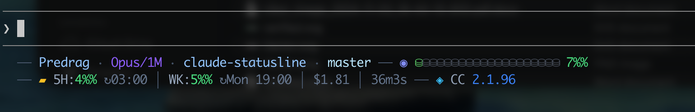

# Claude Code Compact Statusline

A compact 2-line status bar for [Claude Code](https://code.claude.com/docs/en/statusline) with gradient context visualization, rate limit tracking, and full session awareness.



## Layout

### Line 1 — Identity & Context

```
── Predrag · Opus/1M · claude-statusline · master ── ◉ ⛁⛁⛁⛁⛁⛁⛁⛁░░░░░░░░░░░░ 7%
```

| Element | Description |
|---------|-------------|
| `Predrag` | Your first name (from `id -F` on macOS, `whoami` elsewhere) |
| `Opus/1M` | Active model short name. Appends `/1M` when context window is 1M tokens |
| `claude-statusline` | Current project directory name |
| `my-session` | Custom session name (only when set via `--name` or `/rename`) |
| `master` | Git branch (shows `detached` for detached HEAD, hidden outside git repos) |
| `wt:feature` | Active worktree name (only during `--worktree` sessions) |
| `@security-reviewer` | Agent name (only when running with `--agent`) |
| `NORMAL` | Vim mode (only when vim mode is enabled) |
| `◉ ⛁⛁⛁...` | Gradient context bar — 20 buckets transitioning green to amber to red as usage grows |
| `7%` | Context window usage percentage, color-coded: green (<40%), amber (40-59%), orange (60-79%), red (80%+) |
| Warning icon | Shown when token count exceeds 200k threshold |

### Line 2 — Limits, Cost & Version

```
── ▰ 5H:4% ↻03:00 | WK:5% ↻Mon 19:00 | $1.81 | 36m3s ── ◈ CC 2.1.96
```

| Element | Description |
|---------|-------------|
| `5H:4%` | 5-hour rolling rate limit usage (Pro/Max subscribers only, hidden otherwise) |
| `↻03:00` | 5-hour rate limit reset time |
| `WK:5%` | 7-day rate limit usage (Pro/Max subscribers only, hidden otherwise) |
| `↻Mon 19:00` | 7-day rate limit reset time (includes day of week) |
| `$1.81(est)` / `$1.81` | Session cost in USD. Shows `(est)` suffix for Pro/Max subscribers (estimated equivalent), exact cost for API users. Hidden when $0.00 |
| `36m3s` | Session duration (hidden at 0) |
| `CC 2.1.96` | Claude Code version |

Rate limit percentages are color-coded with the same thresholds as context usage.

## Install

1. Copy the script and make it executable:

```bash
cp statusline-command.sh ~/.claude/statusline-command.sh
chmod +x ~/.claude/statusline-command.sh
```

2. Add to `~/.claude/settings.json`:

```json
{
  "statusLine": {
    "type": "command",
    "command": "~/.claude/statusline-command.sh"
  }
}
```

3. Restart Claude Code.

## Requirements

- `jq` — JSON parsing (`brew install jq` / `apt install jq`)
- `git` — optional, for branch display
- A terminal with truecolor support (Kitty, iTerm2, WezTerm, Ghostty)

## Color Thresholds

Usage percentages (context, 5H, 7D) change color based on severity:

| Range | Color |
|-------|-------|
| 0-39% | Green |
| 40-59% | Amber |
| 60-79% | Orange |
| 80-100% | Red |

The context bar uses a smooth gradient across all 20 buckets, transitioning from green through amber to red.

## Features

- **Single `jq` call** — all JSON fields extracted in one pass, no `eval`
- **Git caching** — branch lookup cached for 5 seconds per session (keyed by `session_id`)
- **Graceful degradation** — rate limits hidden for non-subscribers, optional fields appear only when present
- **Portable** — works on macOS and Linux (`date`, `stat`, `id` cross-platform fallbacks)
- **Safe input handling** — JSON parsed via here-string, no pipes, no `eval`
- **Future-proof** — unknown model names display their full `display_name`

## Testing

Test with mock JSON input:

```bash
echo '{"model":{"display_name":"Opus"},"workspace":{"current_dir":"/home/user/project"},"context_window":{"used_percentage":42,"context_window_size":1000000},"session_id":"test","version":"2.1.96","cost":{"total_cost_usd":1.23,"total_duration_ms":120000},"exceeds_200k_tokens":false,"rate_limits":{"five_hour":{"used_percentage":15,"resets_at":1738425600},"seven_day":{"used_percentage":8,"resets_at":1738857600}}}' | ./statusline-command.sh
```
